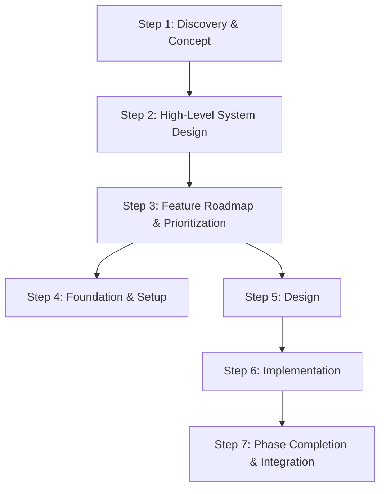

# SDD Flow - AI Coding Assistant Framework

A structured **Spec-Driven Development (SDD)** methodology and toolkit for building applications with AI coding agents.

Based on a proposition **SPECS ARE THE NEW CODE**. The code written on a programming language is just an artefact of the specs compilation. Similar as binaries are artefacts of the code compilation.

## 📋 Overview

This repository contains a comprehensive framework for managing AI-assisted software development projects. It includes

- **Structured Methodology**: A hybrid Waterfall-Agile approach tailored for AI coding assistants
- **Documentation Templates**: Ready-to-use templates for all project phases
- **Development Standards**: Guidelines for maintaining code quality and consistency
- **Prompt Library**: Predefined prompts for common development tasks to use as **custom slash commands** or **subagents**

## General Methodology Workflow



More detailed workflow description in the [sdd-workflow.md](sdd-workflow.md) file.

## 🚀 Getting Started

### Prerequisites

- Basic understanding of software development workflows
- Access to AI coding assistants (like Claude, GitHub Copilot, etc.)
- Version control system (Git recommended)

### Project Structure

```
AICoding/
├── sdd-workflow.md  # The main methodology doc with workflow and references to all other files
├── common/                 # Shared helper prompts and standards
├── prompts/                # AI prompt templates
│   ├── 1.1_initial_hypothesis.md
│   ├── 2_system_architecture.md
│   ├── 5.1_functional_design.md
│   └── ...
├── templates/              # Document templates
│   ├── 1.1_initial_hypothesis.md
│   ├── 2_system_architecture.md
│   └── ...
├── general-preferences.md  # templates for AI assistant steering files (CLAUDE.md, GEMINI.md, etc)

```

## 🛠️ Usage

After cloning this repository to your local machine, you can start a new project by following the steps:

1. **Start a New Project** in a separate folder

2. **Copy or create symlinks for templates** - see the [templates/README.md](templates/README.md) for details

3. **Create custom commands or subagents via symlinks for prompts** - see the [prompts/README.md](prompts/README.md) for details

4. **Copy or create symlinks for common files** - see the [common/README.md](common/README.md) for details

5. **Follow the flow** - see the complete workflow in [sdd-workflow.md](sdd-workflow.md)

You can always copy-paste the content of the prompts and templates to your project or LLM chats (ChatGPT, Gemini, Claude, etc) and adjust them to your needs.

## 🤝 Contributing

Contributions are welcome! Please try it out!

Reach me in Telegram directly [@ataden](https://t.me/ataden) for any questions or feedback.

## 📄 License

This project is licensed under the MIT License
