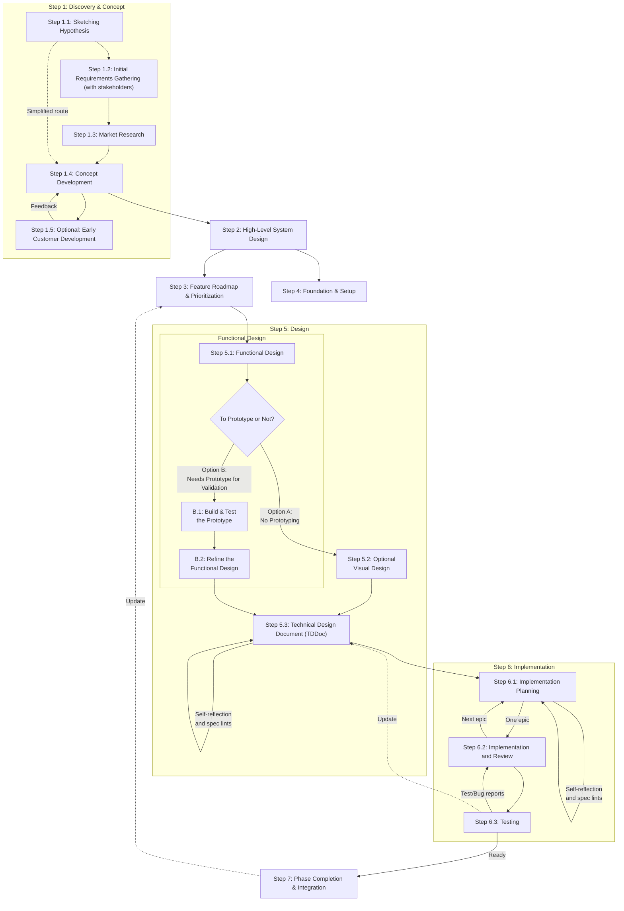

# Methodology for the Building of Applications with AI Coding Agents

## Key Principles

The key approach is to use a hybrid of Waterfall and Agile methodologies to balance stability and flexibility.

### Waterfall Elements (Stability)

1. **Clear Foundation**: Core architecture and business model don't change frequently
2. **AI Context**: Consistent system design helps AI agents understand the codebase
3. **Risk Mitigation**: Major architectural decisions made with full information
4. **Quality Standards**: Established patterns for AI agents to follow

### Agile Elements (Flexibility)

1. **Feature-Level Iteration**: Each feature goes through its own design-build-test cycle
2. **Rapid Feedback**: Quick validation of assumptions with working software
3. **User-Centric**: Regular user input shapes feature development
4. **Adaptive**: Process improves based on what works with AI agents

### AI-Specific Adaptations

1. **Prompt Engineering**: Iterative improvement of AI instructions
2. **Context Management**: Maintaining consistent AI understanding across sprints
3. **Quality Validation**: Human oversight of AI-generated code
4. **Learning Integration**: Capturing and applying AI coding patterns

## Methodology Overview Diagram

## Step 1: Discovery & Concept

### Step 1.1 Sketching Hypothesis

_This is an initial brainstorming session to identify a potential problem or opportunity and formulate an initial hypothesis about a potential solution and its value. Can be in the form of audio recording that is transcribed and then refined with LLMs to produce the Initial Hypothesis Document. It can also involve creating an optional low-fidelity prototype to visualize the concept._

**Activities:**

- **Identify a potential problem** or opportunity.
- **Formulate an initial hypothesis** about a potential solution and its value
- **Define a target audience** for the proposed solution.
- **Outline key assumptions** that need to be validated.
- **(Optional) Create a low-fidelity UI prototype** clickable with stubbed interactions to make the concept tangible.

**Deliverables:**

- **Initial Hypothesis Document**

  - _Format: A brief, 2-3 page document._
  - _Template: [templates/1.1_initial_hypothesis.md](templates/1.1_initial_hypothesis.md)_
  - _Prompt: [prompts/1.1_initial_hypothesis.md](prompts/1.1_initial_hypothesis.md)_

- **Open Questions List**

  - _Format: A list of questions that need to be answered to refine the hypothesis with stakeholders._

- **Low-Fidelity Prototype (optional)**
  - _Format: Clickable wireframes or a simple UI with stubbed data and interactions._
  - _Purpose: To demonstrate the core concept to stakeholders and product partners for early feedback._

**Optional:** on this stage a comprehensive concept can be already created. So, in 1.2 only Market Research is needed and then the Initial Hypothesis Document transformed to the Concept Document, ready to be passed to 1.5 CustDev step.

### Step 1.2 Initial Requirements Gathering (with stakeholders)

_Stakeholders are the people who are affected by the problem or opportunity and have a vested interest in the solution. Mostly the project team, product owners, and sometimes the customers._

**Activities:**

- **Stakeholder interviews (if available)** and user research. The optional prototype from Step 1.1 can be used to facilitate these discussions.
- **Problem validation** - ensure you're solving a real problem
- **Market analysis** and competitive landscape
- **Success metrics definition** (KPIs, user adoption goals)

**Deliverables:**

- **Stakeholder Interview Notes (optional)**
  - _Format: Simple notes or transcripts_
  - _Content: Pain points, needs, expectations, constraints, etc._
- **Refined Initial Hypothesis Document**

### Step 1.3. Market Research

**Activities:**

- **Market research** - analyze the market and identify the target audience
- **Competitive analysis** - analyze the competition and identify the unique selling proposition
- **Success metrics definition** (KPIs, user adoption goals)

The report is completed by AI in Deep Research mode - multiple models (ChatGPT, Claude, Gemini, etc) are used to generate the reports.

**Deliverables:**

- **Market Research Report**
  - _Format: A detailed market research report documents._
  - _Template: [templates/1.3_market_research_report.md](templates/1.3_market_research_report.md)_
  - _Prompt: [prompts/1.3_market_research_report.md](prompts/1.3_market_research_report.md)_

### Step 1.4 Concept Development

**Activities:**

- **Value proposition** articulation
- **Concept Document** creation
- **Risk assessment** and mitigation strategies

**Deliverables:**

- **Concept Document**
  - _Converted from Initial Hypothesis Document after market research and stakeholder interviews_
  - _Template (same as Initial Hypothesis Document): [templates/1.1_initial_hypothesis.md](templates/1.1_initial_hypothesis.md)_
  - _Length: 5-10 pages_

### Step 1.5 Early Customer Development - CustDev (optional)

_Use when you can identify and collaborate with users to validate concepts and gather deep insights. This can involve two distinct feedback groups: Product Partners and "fresh eyes" usability testers._

**Activities:**

- **Identify and recruit Product Partners**: Find deeply engaged users who feel the problem and can provide strategic feedback on the solution's value. Offer them some perks like a free usage of the product or service. Establish a feedback loop and communication channel with partners.
- **Conduct in-depth problem/solution interviews** with these partners. Present initial concepts to Product Partners for early validation. The optional prototype can be a key tool for this.
- **Refine the Initial Hypothesis Document** based on the feedback from the Product Partners.

**Deliverables:**

- **Product Partner List**
  - _Content: List of confirmed early adopters, their profiles, and engagement agreements._
- **Customer Interview Insights**
  - template: [templates/1.5_draft_customer_interview_insights.md](templates/1.5_draft_customer_interview_insights.md)
- **Early Validation Report**
  -template: [templates/1.5_draft_early_validation_report.md](templates/1.5_draft_early_validation_report.md)

## Step 2: High-Level System Design

**Activities:**

- **Overall system architecture** and technology stack selection
- **Core data models** and main entities
- **Security and compliance framework**
- **Development standards** and AI coding guidelines
- **Quality gates** and testing strategy

**Deliverables:**

- **System Architecture Document**

  - _Format: Text + Visual diagrams (mermaid)_
  - _Template: [templates/2_system_architecture.md](templates/2_system_architecture.md)_
  - _Prompt: [prompts/2_system_architecture.md](prompts/2_system_architecture.md)_

- **Development and Testing Standards Document**
  - _Content: Code style guides, naming conventions, quality checklists, system-wide Non-Functional Requirements (Performance, Accessibility, etc.)_
  - _Format: md document (rules for the AI agents)_
  - _Template: TBD_

## Step 3: Feature Roadmap & Prioritization

**Activities:**

- **Feature breakdown** into development phases
- **Prioritisation and planning** must-have vs nice-to-have, dependency mapping between features, and a timeline for the development of the features.
- **Risk assessment (optional)** for each major feature
- **Success metrics (optional)** for each development phase

**Deliverables:**

- **Feature Roadmap**
  - _Format: Timeline with phases, optoinal Gantt chart _
  - _template: [templates/3_feature_roadmap.md](templates/3_feature_roadmap.md)_
  - _prompt: [prompts/3_feature_roadmap.md](prompts/3_feature_roadmap.md)_

**Notes:**

- ideally, each Phase must contain maximum functionality without a deep integration with other features/phases
- small changes (new features of existing functionality, bug fixes )

## Step 4: Foundation & Setup

_This phase focuses on creating the foundational infrastructure and environment needed to begin development._

**Activities:**

- **Infrastructure Provisioning:** Set up cloud resources (servers, databases, storage) as defined in the System Architecture. Optional: using Infrastructure as Code (IaC) tools (e.g., Terraform, Pulumi, etc.).
- **Environment Setup:** Configure development, testing, staging, and production environments.
- **Repository & CI/CD Setup:** Create version control repositories (e.g., Git) and establish continuous integration/continuous deployment (CI/CD) pipelines (optional).
- **Project Scaffolding:** Initialize the codebase with the chosen frameworks and boilerplates (e.g., `create-next-app`, `dotnet new`).
- **Core Services Integration:** Set up and integrate core third-party services like authentication, email, or payment gateways.
- **Monitoring & Observability Setup:** Configure logging, monitoring, and alerting tools to track application health.
- **Project Management & Communication Setup (optional):** Configure project boards (e.g., Jira, Trello) and communication channels (e.g., Slack, Teams).

**Deliverables:**

- **Provisioned Infrastructure:** A document or link to the configured cloud infrastructure.
- **Environment Access Details:** Secure credentials and access instructions for all environments.
- **CI/CD Pipeline:** A functional pipeline that builds, tests, and deploys the application (optional).
- **Initial Code Repository:** A repository with the basic project structure and boilerplate code.
- **Integrated Services Map:** Actual map of the integrated services and their status.
- **Monitoring Dashboards:** Links to initial dashboards for logs and metrics.
- **Project Management Board:** A ready-to-use board for tracking feature development (optional).

## Step 5: Design

_Notes_:

- all the artifacts in this Step 5 (Functional Design, Technical Design, UI Design) must be created on the firsts Phase and then updated by introduction of new phases
- in the implementation process these artifacts are updated and refined (with specs linter, TBD) - to make sure the actual implementation matches the design

### Step 5.1: Functional Design

**Activities:**

- **High-level user stories** for the specific feature
- **Basic workflow mapping** for the feature
- **Rough UI/UX concepts** and ideas
- **Initial acceptance criteria** draft

**Deliverables:**

- **Functional Design Document**
  - template: [templates/5.1_functional_design.md](templates/5.1_functional_design.md)
  - prompt: [prompts/5.1_functional_design.md](prompts/5.1_functional_design.md)

**Decision Point: To Prototype or Not?**

_Based on the initial functional design, assess complexity and uncertainty to choose the next step._

**When to Use Rapid Prototyping:**

_Always Prototype When:_

- Feature is complex or has unclear requirements
- Features in this phase can be implemented in a standalone app without deep integration with other features !!!
- User behavior is uncertain
- Technical feasibility is questionable
- Stakeholder alignment is needed

_Skip Prototyping When:_

- Feature is straightforward and well-understood
- It is hard to implement in a standalone app without deep integration with other features !!!
- Similar patterns exist in the codebase
- Time constraints are critical
- Requirements are crystal clear

**Choose Your Path:**

#### Option A: Refine Design & Proceed (No Prototyping)

Proceed to Step 5.2: Visual Design

#### Option B: Validate with a Rapid Prototype

**B.1. Build & Test the Prototype**

**Activities:**

- **AI-generated prototypes** (can be throwaway code)
- **Conduct validation sessions** with both **Product Partners** (to test value) and **recruited usability testers** (to test clarity).
- **Stakeholder validation** of core concepts
- **Technical feasibility** validation
- **Pivot or proceed** decision

**Tools**:

- v0.dev
- Lovable
- Bolt
- etc.

**Deliverables:**

- **Working Prototype**
- **User Testing & Partner Feedback Report (optional)**
  - \*Content: A consolidated report with two distinct sections:
    - **Partner Feedback:** Insights on core functionality, value proposition, and strategic fit.
    - **Usability Testing Results:** Findings from "fresh eyes" testers, focusing on clarity, intuition, and ease of use.\*
- **Stakeholder Validation Report (optional)**
- **Technical Feasibility Assessment (optional)**
- **Go/No-Go Decision Document (optional)**

**B.2. Refine the Functional Design**
_After prototype validation, incorporate learnings to finalize the design._
**Activities:**

- **Refine user stories** based on prototype learnings.
- **Update workflow mapping** incorporating feedback.
- **Confirm integration points** with existing features.
- **Finalize acceptance criteria**.

**Deliverables:**

- **Final Functional Design Document**

### Step 5.2:Visual Design

_Use when high-fidelity, pixel-perfect visuals are required before development. For simpler UIs or internal tools, the wireframes from the functional design and a prototype (if available) may be sufficient._

**Activities:**

- **Apply branding**, color palette, and typography to the approved wireframes.
- **Create high-fidelity mockups** for key screens and components.
- **Define visual style guide** elements (e.g., button states, spacing, iconography).
- **Stakeholder and product partner review** and approval of the final look and feel.

**Deliverables:**

- **High-Fidelity Design**
  - _Content: Pixel-perfect static designs representing the final user interface._
  - _Fidelity: High (includes colors, branding, and detailed styling)._
  - _Tools: Figma, Sketch, Adobe XD_
- **Visual Style Guide (or component library update)**
  - _Content: Specifications for colors, fonts, spacing, icon usage, and component styles._

### Step 5.3: Technical Design

_Translate the functional design (and optional visual design) into a detailed technical blueprint for implementation._

**Activities:**

- **Define/Refine component architecture** for the Phase.
- **Design API endpoints** and data contracts (if applicable).
- **Plan database schema modifications** and data migration.
- **Identify key libraries** or dependencies.
- **Outline the implementation strategy** and potential challenges.

**Deliverable: Technical Design Document (TDDoc)**
_A single, comprehensive document detailing the technical implementation plan. It should be a living document, updated as needed during development. It contains code snippets only if strictly necessary._

- template: [templates/5.3_technical_design.md](templates/5.3_technical_design.md)
- prompt: [prompts/5.3_technical_design.md](prompts/5.3_technical_design.md)

_Notes:_

- complex TDDoc must be run through the additional review (self-reflection and spec lints) with AI to ensure it is correct and complete. Prompt: [prompts/5.3_technical_design_review.md](prompts/5.3_technical_design_review.md)
- after each modification of the TDDoc, running a spec linter is required to ensure the TDDoc internal consistency and with codebase - prompt: [prompts/5.3_technical_design_lint.md](prompts/5.3_technical_design_lint.md).

## Step 6: Implementation

### Step 6.1: Implementation Planning

_This phase is about creating a detailed execution plan based on the Technical Design Document._
**Activities:**

- **Work Breakdown:** Decompose the feature into a hierarchy of smaller, manageable tasks - WBS (Work Breakdown Structure) in Steps and Tasks(checklist)
- **Task Sequencing & Dependency Mapping:** Identify the logical order of tasks and how they connect.
- **Milestones (optional):** Identify the milestones for the feature.
- **Dependencies:** Identify the dependencies between the tasks (if any)

**Deliverables:**

- **📋 Implementation Plan:** A hierarchical list of all tasks with with milestones and dependencies, with checklists for each task.
  - template: [templates/6.1_implementation_plan.md](templates/6.1_implementation_plan.md)
  - prompt: [prompts/6.1_implementation_plan.md](prompts/6.1_implementation_plan.md)
- **Gantt Chart (optional):** A visual representation of the tasks and their dependencies (mermaid) - after the Implementation Plan is created and approved

_Notes:_

- the Implementation Plan must be created by the top-performing AI coding agent (Claude Opus, etc )
- complex Implementation Plan must be run through the additional review (self-reflection and spec lints) with AI to ensure it is correct and complete. Prompt: [prompts/6.1_implementation_plan_review-prompt.md](prompts/6.1_implementation_plan_review-prompt.md)

### Step 6.2: Implementation and Review

_This phase is about executing the plan by steering the AI coding agent._
**Activities:**

- **Code Development:** AI coding agent implements the tasks in the `Implementation Plan` based on the task list.
- **Progress Tracking:** Regular check-ins to monitor the AI coding agent progress. Marking tasks as completed, writing the implementation report.
- **Testing plan development:** Create a testing plan for the feature based on what was implemented.
- **Code review (optional):** Code review of the AI coding agent code by another coding agent.

**Deliverables:**

- **Working Code** and logs of the AI coding agent
- **Implementation Report**
  - template: [prompts/6.2_implementation_report.md](prompts/6.2_implementation_report.md)
- **Testing Plan:** Test plan for the feature based on what was implemented.
  - template: [prompts/6.2_testing_plan.md](prompts/6.2_testing_plan.md)
  - prompt: [prompts/6.2_testing_plan.md](prompts/6.2_testing_plan.md)
- **Code Review Report (optional):**
- template: [prompts/6.2_code_review_report.md](prompts/6.2_code_review_report.md)
- prompt: [prompts/6.2_code_review_report.md](prompts/6.2_code_review_report.md)

### Step 6.3: Testing

**Activities:**

- **Testing:** Implementation and execution of unit/integration/e2e/regression tests as defined in the test plan.
- **Progress Tracking:** Regular check-ins to monitor progress against the schedule. Marking tasks as completed.
- **Spec Lint:** Updating the Technical Specification Document and Functionality Specifications when needed. Prompt: [prompts/5.3_technical_design_lint.md](prompts/5.3_technical_design_lint.md)

**Deliverables:**

- **Testing Report:**
  - template: [prompts/6.3_testing_report.md](prompts/6.3_testing_report.md)
- **Bug List (optional):** List of bugs found during the testing.
  - template: [prompts/6.3_bug_list.md](prompts/6.3_bug_list.md)
- **Updates List (optional):** List of updates made during the testing (not bugs but small changes to the ui, etc)
  - template: [prompts/6.3_updates_list.md](prompts/6.3_updates_list.md)
- **Updated Project Documentation:** TDDoc, FDD, UI Design

_Notes:_

- **small bugs** are fixed during the testing,
- **big bugs** are described in the testing report and fixed separately running the command fix-bug. Template: [prompts/6.3_fix_bug.md](prompts/6.3_fix_bug.md) or fix-test, template: [prompts/6.3_fix_test.md](prompts/6.3_fix_test.md)

## Step 7: Phase Completion & Integration

**Activities:**

- **User Documentation** creation of guides, screencasts, etc.
- **Deployment** to staging/production
- **User acceptance** validation, A/B testing, etc.
- **Metrics collection** and analysis

**Deliverables:**

- **Updated Project Documentation** if needed:
  - system architecture
  - roadmap
  - design documents (FDD, TDDoc, UI Design)
- **User Documentation**: tutorials, guides, screencasts, etc.
- **Phase Acceptance Report (optional)**
  - _Content: All acceptance criteria met, stakeholder sign-off_

## Appendix: Templates & Prompts Summary

TBD
