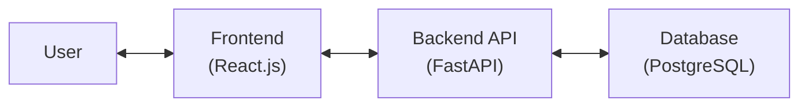
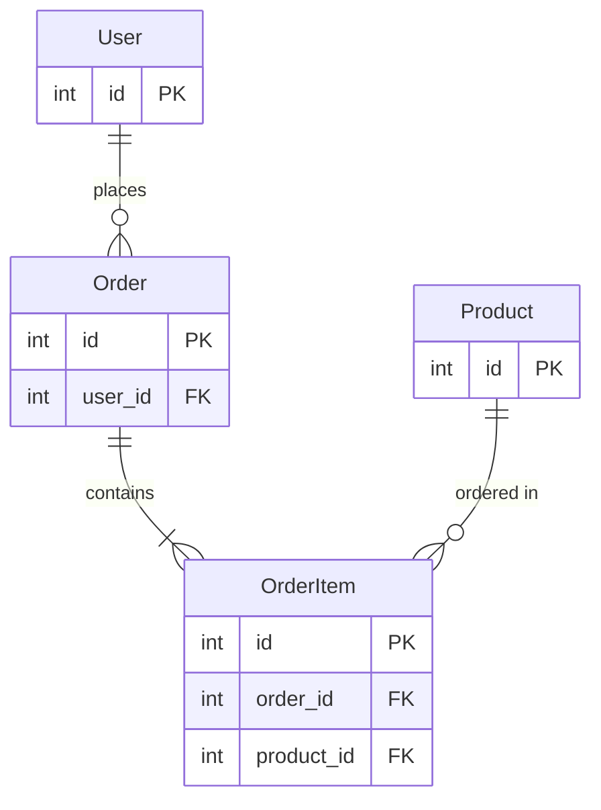

# 🏗️ System Architecture Document

*Project Name: [INSERT PROJECT NAME]*  
*Version: [INSERT VERSION]*  
*Date: [INSERT DATE]*  
*Author(s): [INSERT AUTHOR(S)]*

---

## Document Overview

This document outlines the high-level system architecture, technology stack, infrastructure design, and core data models for [PROJECT NAME]. It serves as the foundational blueprint for all development activities and provides essential context for AI coding agents.

**Purpose:** Define the overall system structure, technology choices, and architectural patterns that will guide feature development.

**Audience:** Development team, stakeholders, AI coding agents, and future maintainers.

---

## 1. Executive Summary

### 1.1 System Purpose
*Brief description of what the system does and its primary objectives.*

[INSERT SYSTEM PURPOSE]

### 1.2 Key Architectural Decisions
*Summary of the most important architectural choices and their rationale.*

- **Architecture Pattern:** [e.g., Microservices, Monolithic, Serverless]
- **Primary Technology Stack:** [e.g., Next.js, Node.js, PostgreSQL]
- **Deployment Strategy:** [e.g., Cloud-native, Container-based]
- **Data Storage Approach:** [e.g., SQL + NoSQL hybrid, Event sourcing]

---

## 2. High-Level Architecture

### 2.1 System Architecture Diagram
*Include a visual representation of the overall system architecture - in a mermaid diagram.*

Example structure:

### 2.2 Component Overview
*High-level description of major system components and their responsibilities.*

Example:
| Component | Technology | Responsibility |
|-----------|------------|---------------|
| Frontend App | React.js + TypeScript | User interface, state management, API communication |
| Backend API | FastAPI + Python | Business logic, data processing, authentication |
| Database | PostgreSQL | Data persistence, query optimization |

---

## 3. Technology Stack

*Detailed description for each major technology choice.*

#### Frontend
- **Technology:** [e.g., Next.js 14]
- **Rationale:** [Why this technology was chosen]
- **UI Framework:** [e.g., Tailwind CSS, Material UI]
- **Component Library:** [e.g., Custom components, shadcn/ui]
- **State Management:** [e.g., Redux, Zustand, React Context]

#### Backend
- **Technology:** [e.g., Node.js with Express]
- **Rationale:** [Why this technology was chosen]
- **Additional Libraries:** 
  - [e.g., Authentication: JWT/Passport.js]
  - [e.g., ORM: Prisma/Sequelize]
  - [e.g., Validation: Joi/Yup]

#### Database
- **Technology:** [e.g., PostgreSQL]
- **Rationale:** [Why this database was chosen]
- **Schema Design:** [e.g., Normalized/Denormalized, specific patterns]

#### Development Tools
- **Package Manager:** [e.g., npm, yarn, pnpm]
- **Code Quality:** [e.g., ESLint, Prettier]
- **Testing:** [e.g., Jest, Vitest, Cypress]
- **Build Tools:** [e.g., Webpack, Vite, Turbo]

Addd more layers if needed (e.g., Cache, Voice, etc.)
---

## 4. Core Data Models

### 4.1 Entity Relationship Diagram
*Visual representation of the main data entities and their relationships. Only fields that are primary or foreign keys should be shown.*

Example:

### 4.2 Data Entities
*Description of all data entities, their key attributes, and relationships.*

#### Entity: [Entity Name]
- **Purpose:** [What this entity represents]
- **Relationships:** [Related entities and relationship types]
- **Business Rules:** [Any important constraints or logic]

---

## 5. User Interface Architecture

### 5.1 UI Architecture Overview
*Describe the overall UI structure and main components.*

- **[Component Name]**
  - Purpose: [What this component does]
  - Key features: [List main features]
- **[Another Component]**
  - Purpose: [What this component does]
  - Key features: [List main features]

### 5.2 Responsive Design Strategy
*Define how the UI adapts to different devices.*

- **Responsive Breakpoints:** [e.g., Mobile (320px+), Tablet (768px+), Desktop (1024px+)]
- **Touch Interactions:** [Mobile-specific interactions]
- **Performance Optimizations:** [e.g., Lazy loading, virtual scrolling]
- **Accessibility Standards:** [e.g., WCAG 2.1 AA compliance]

---

## 6. Performance & Scalability

### 6.1 Performance Targets
*Define specific performance goals and metrics.*

- **Page Load Time:** [e.g., < 3 seconds on 3G]
- **API Response Time:** [e.g., < 200ms for 95th percentile]
- **Database Query Performance:** [e.g., < 100ms for typical queries]
- **Concurrent Users:** [e.g., Support 1000 concurrent users]

### 6.2 Optimization Strategies
*Specific techniques to achieve performance targets.*

- **Database Optimization:** [Indexing strategy, query optimization]
- **Caching Strategy:** [What to cache, cache invalidation]
- **Frontend Optimization:** [Bundle size, code splitting, lazy loading]
- **API Optimization:** [Response compression, pagination]

### 6.3 Scalability Considerations
*How the system will handle growth.*

- **Horizontal Scaling:** [How components scale out]
- **Vertical Scaling:** [Resource limits and upgrade paths]
- **Data Partitioning:** [Sharding strategy if applicable]
- **Load Balancing:** [Distribution strategy]

---

## 7. Security & Data Protection

### 7.1 Security Measures
*Core security implementations.*

- **Input Validation:** [Validation approach and tools]
- **SQL Injection Prevention:** [ORM usage, prepared statements]
- **XSS Prevention:** [Content sanitization strategy]
- **CSRF Protection:** [Token implementation]
- **Rate Limiting:** [API throttling rules]

### 7.2 Authentication & Authorization
*How users are authenticated and authorized.*

- **Authentication Method:** [e.g., JWT, OAuth2, Session-based]
- **Authorization Model:** [e.g., RBAC, ABAC, ACL]
- **Token Management:** [Expiry, refresh strategy]
- **Multi-Factor Authentication:** [If applicable]

### 7.3 Data Privacy & Compliance
*Privacy and regulatory compliance measures.*

- **Data Encryption:** [At rest and in transit]
- **PII Handling:** [How personal data is protected]
- **Compliance Requirements:** [e.g., GDPR, CCPA, HIPAA]
- **Data Retention Policy:** [How long data is kept]
- **Audit Logging:** [What actions are logged]

---

## 8. Deployment & Operations

### 8.1 Deployment Strategy
*How the application is deployed and maintained.*

- **Deployment Method:** [e.g., Container-based, Serverless, Traditional]
- **Environment Strategy:** [Dev, Staging, Production setup]
- **CI/CD Pipeline:** [Build, test, deploy automation]
- **Infrastructure as Code:** [e.g., Terraform, CloudFormation]

### 8.2 Monitoring & Maintenance
*How the system is monitored and maintained.*

- **Application Monitoring:** [e.g., APM tools, custom metrics]
- **Infrastructure Monitoring:** [Server metrics, alerts]
- **Log Management:** [Centralized logging strategy]
- **Error Tracking:** [e.g., Sentry, Rollbar]
- **Backup Strategy:** [Frequency, retention, recovery]
- **Update Process:** [Rolling updates, blue-green deployment]

### 8.3 Disaster Recovery
*Plans for system recovery.*

- **RTO/RPO Targets:** [Recovery time and point objectives]
- **Backup Procedures:** [What is backed up and how often]
- **Failover Strategy:** [How to handle component failures]
- **Data Recovery:** [Procedures for data restoration]

---

## 9. Technical Considerations

### 9.1 Known Limitations
*Current system limitations and constraints.*

- **Technical Limitations:** [e.g., Technology constraints]
- **Functional Limitations:** [What the system doesn't do]
- **Scale Limitations:** [Maximum capacity]
- **Integration Limitations:** [External system constraints]

### 9.2 Technical Debt & Mitigation
*Identified technical debt and plans to address it.*

- **Known Technical Debt:** [List of shortcuts taken]
- **Mitigation Strategy:** [How and when to address]
- **Refactoring Plans:** [Areas needing improvement]

### 9.3 Migration & Upgrade Paths
*How the system can evolve.*

- **Technology Upgrades:** [Framework/library update strategy]
- **Data Migration:** [Schema evolution approach]
- **API Versioning:** [How breaking changes are handled]
- **Feature Deprecation:** [Process for removing features]

---

## 10. References & Resources

### 10.1 Related Documents
*Links to other project documentation.*

- Concept Document: [e.g., 1_concept.md]
- Technical Specifications: [e.g., 3_technical_specs.md]
- API Documentation: [e.g., 4_api_docs.md]
- Deployment Guide: [e.g., 5_deployment.md]

### 10.2 External Resources
*Useful external documentation and resources.*

- [Technology Documentation Links]
- [Best Practices Guides]
- [Security Guidelines]
- [Performance Optimization Resources]

### 10.3 Glossary
*Define project-specific terms and acronyms.*

| Term | Definition |
|------|------------|
| [Term 1] | [Definition] |
| [Term 2] | [Definition] |
| [Acronym] | [Full form and explanation] |

---
### Appendices
*Additional information and details.*
